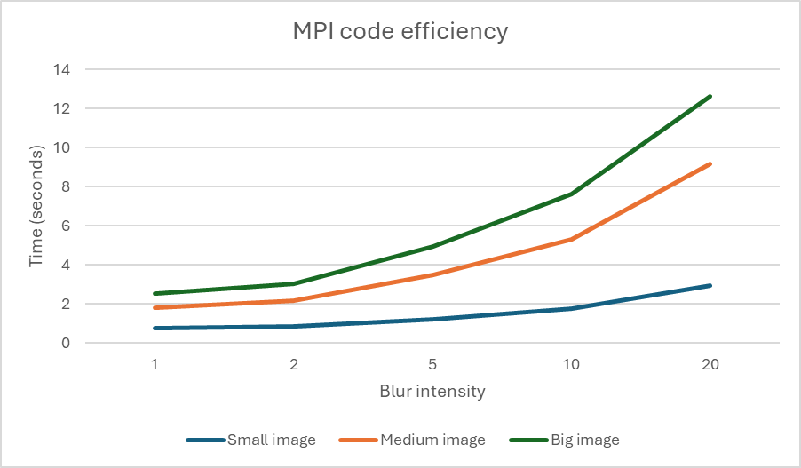
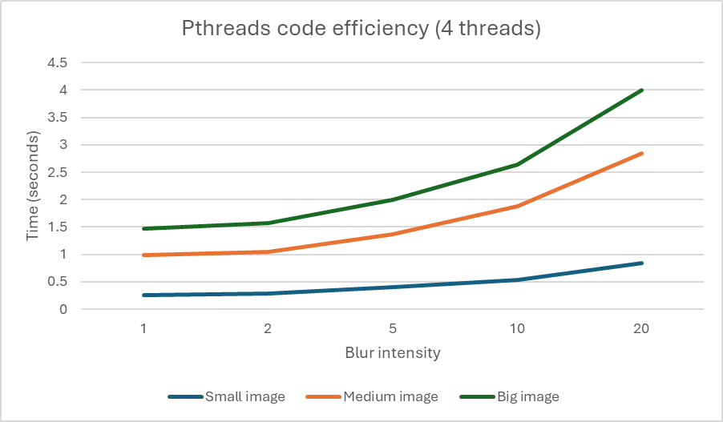
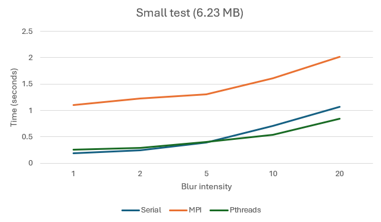
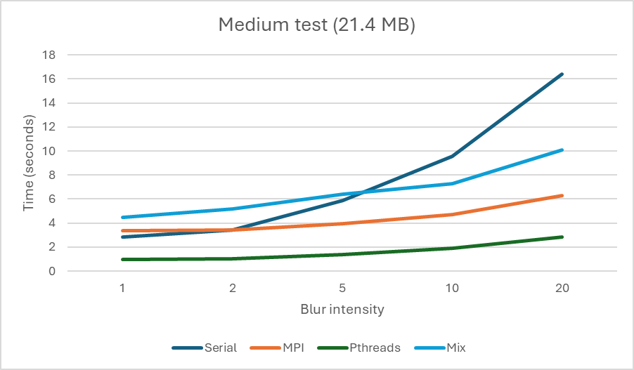
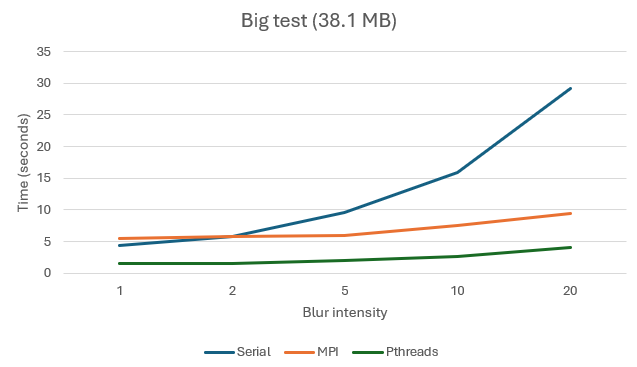

# Convolution-based image filters

### Students: 

- Boiangiu Victor-Miron

- Irimia Marian

### Lab tutor: 

- Calafeteanu Tudor-Alexandru 

# Notes

- Link to BMP library used in this project: [Github.com](https://github.com/mattflow/cbmp)

# Weekly updates

- Week 1 : Sequential algorithm & profiling

- Week 2 : Parallel version using MPI 

- Week 3: Parallel version using PThreads

- Week 4 : Profilling and Graphs for MPI & Pthreads

# Description

In this project, we are going to apply convolution-based filters on images, more specifically gaussian blur, and then check how different parallelization techniques affect the performance.

- Example input:


- Example output:


# Temporal Complexity

### Pseudocode
```
Function apply_convolution(matrix, N, M, kernel, k_width, k_height):
    Allocate a new matrix with the same dimensions as the original (M x N)
    
    For each x from 0 to N - 1:
        For each y from 0 to M - 1:
            Call apply_convolution_at_pos(matrix, N, M, kernel, k_width, k_height, x, y)
            Store the returned value in new_matrix[y][x]
    
    For each x from 0 to N - 1:
        For each y from 0 to M - 1:
            Copy new_matrix[y][x] to matrix[y][x]

    Free memory allocated for new_matrix


Function apply_convolution_at_pos(matrix, N, M, kernel, k_width, k_height, pos_x, pos_y):
    Initialize result to 0
    Set delta_x to (k_width / 2)
    Set delta_y to (k_height / 2)
    
    For each kernel_y from 0 to k_height - 1:
        For each kernel_x from 0 to k_width - 1:
            Calculate corresponding_matrix_x = pos_x - delta_x + kernel_x
            Calculate corresponding_matrix_y = pos_y - delta_y + kernel_y

            If corresponding_matrix_x is out of bounds (i.e., < 0 or >= N) or
               corresponding_matrix_y is out of bounds (i.e., < 0 or >= M):
                Return matrix[pos_y][pos_x] // Pixel is out of bounds, return original value
            
            Multiply kernel[kernel_y][kernel_x] by matrix[corresponding_matrix_y][corresponding_matrix_x]
            Add the result to the total result

    If result > 255:
        Set result to 255 // Clamp the result to the valid pixel range [0, 255]

    Return result
```

### Sequential

The complexity of the sequential algorithm is O(N*M), where N is the width of the image and M is the height of the image. This results from calling apply_convolution_as_pos (which runs in constant time, as its for-loops go to 9 total loops at most, the convolution matrix being of size 3x3) on each pixel of the image.

# Spatial complexity

### Sequential

The spatial complexity is, just as the temporal one, O(N*M), as we cannot apply the convolution in-place, we have to create another array of
pixels the size of the original image and put the resulting values from the convolution there.

# Run tests:

``` make <test_small/test_medium/test_big> ```

# Code analysis:

***WSL Version*** : Wsman Shell commandLine, version 0.2.1.

***Architecture***:            x86_64 

***CPU op-mode(s)***:        32-bit, 64-bit 

***Address sizes***:         39 bits physical, 48 bits virtual

***Byte Order***:            Little Endian 

***CPU(s)***:                  8

***On-line CPU(s) list***:   0-7

***Vendor ID***:               GenuineIntel

***Model name***:            Intel(R) Core(TM) i5-10300H CPU @ 2.50GHz

***CPU family***:          6    

***Model***:               165   

***Thread(s) per core***:  2  

***Core(s) per socket***:  4 

***Socket(s)***:           1 

***Stepping***:            2 


## Serial

The serial algorithm was tested based on image sizes and blur intensity, multiple times.


### Profiling:

- Small image, 1 layer of blur :

| % Time | Cumulative Seconds | Self Seconds | Calls     | Self ms/call | Total ms/call | Name                      |
|--------|--------------------|--------------|-----------|--------------|---------------|---------------------------|
| 48.39  | 0.15               | 0.15         | 2178576   | 0.00         | 0.00          | apply_convolution_at_pos   |
| 24.19  | 0.23               | 0.07         | 13071456  | 0.00         | 0.00          | _get_pixel                 |
| 9.68   | 0.26               | 0.03         | 2178576   | 0.00         | 0.00          | get_pixel_rgb              |
| 6.45   | 0.28               | 0.02         | 2178576   | 0.00         | 0.00          | set_pixel_rgb              |
| 3.23   | 0.28               | 0.01         | 6535728   | 0.00         | 0.00          | _update_file_byte_contents |
| 3.23   | 0.29               | 0.01         | 1         | 10.00        | 70.00         | open_bmp_image             |
| 3.23   | 0.30               | 0.01         | 1         | 10.00        | 90.00         | save_bmp_image             |
| 1.61   | 0.31               | 0.01         | 3         | 1.67         | 30.00         | _map                       |

- Small image, 20 layers of blur :

| % Time | Cumulative Seconds | Self Seconds | Calls     | Self ms/call | Total ms/call | Name                      |
|--------|--------------------|--------------|-----------|--------------|---------------|---------------------------|
| 90.39  | 2.54               | 2.54         | 43571520  | 0.00         | 0.00          | apply_convolution_at_pos   |
| 4.63   | 2.67               | 0.13         | 20        | 6.50         | 133.50        | apply_convolution          |
| 1.42   | 2.71               | 0.04         | 1         | 40.00        | 70.00         | open_bmp_image             |
| 1.07   | 2.74               | 0.03         | 13071464  | 0.00         | 0.00          | _get_int_from_buffer       |
| 1.07   | 2.77               | 0.03         | 13071456  | 0.00         | 0.00          | _get_pixel                 |
| 0.71   | 2.79               | 0.02         | 3         | 6.67         | 30.00         | _map                       |
| 0.36   | 2.80               | 0.01         | 6535728   | 0.00         | 0.00          | _update_file_byte_contents |
| 0.36   | 2.81               | 0.01         | 2178576   | 0.00         | 0.00          | set_pixel_rgb              |

- Medium image, 1 layer of blur:

| % Time | Cumulative Seconds | Self Seconds | Calls     | Self ms/Call | Total ms/Call | Function Name                     |
|--------|--------------------|--------------|-----------|--------------|---------------|-----------------------------------|
| 34.48  | 0.50               | 0.50         | 7,500,000 | 0.00         | 0.00          | apply_convolution_at_pos          |
| 12.41  | 0.68               | 0.18         | 45,000,008| 0.00         | 0.00          | _get_int_from_buffer              |
| 11.03  | 0.84               | 0.16         | 3         | 53.33        | 183.33        | _map                              |
| 8.97   | 0.97               | 0.13         | 1         | 130.00       | 630.00        | apply_convolution                 |
| 7.59   | 1.08               | 0.11         | 45,000,000| 0.00         | 0.00          | _get_pixel                        |
| 7.59   | 1.19               | 0.11         | 1         | 110.00       | 516.67        | save_bmp_image                    |
| 6.90   | 1.29               | 0.10         | 22,500,000| 0.00         | 0.00          | _update_file_byte_contents        |
| 4.83   | 1.36               | 0.07         | 1         | 70.00        | 303.33        | open_bmp_image                    |
| 2.76   | 1.40               | 0.04         | 7,500,000 | 0.00         | 0.00          | get_pixel_rgb                     |
| 2.07   | 1.43               | 0.03         | 7,500,000 | 0.00         | 0.00          | set_pixel_rgb                     |
| 0.69   | 1.44               | 0.01         | 2         | 5.00         | 5.00          | _get_file_byte_number             |
| 0.69   | 1.45               | 0.01         | 2         | 5.00         | 188.33        | _populate_pixel_array             |

- Medium image, 20 layers of blur:

| % Time | Cumulative Seconds | Self Seconds | Calls     | Self ms/Call | Total ms/Call | Function Name                     |
|--------|--------------------|--------------|-----------|--------------|---------------|-----------------------------------|
| 76.61  | 11.27              | 11.27        | 150,000,000| 0.00         | 0.00          | apply_convolution_at_pos         |
| 18.97  | 14.06              | 2.79         | 20        | 139.50       | 703.00        | apply_convolution                 |
| 0.99   | 14.21              | 0.14         | 45,000,000| 0.00         | 0.00          | _get_pixel                        |
| 0.92   | 14.34              | 0.14         | 45,000,008| 0.00         | 0.00          | _get_int_from_buffer              |
| 0.65   | 14.44              | 0.10         | 3         | 31.67        | 135.00        | _map                              |
| 0.54   | 14.52              | 0.08         | 7,500,000 | 0.00         | 0.00          | get_pixel_rgb                     |
| 0.54   | 14.60              | 0.08         | 1         | 80.00        | 377.50        | save_bmp_image                    |
| 0.34   | 14.64              | 0.05         | 1         | 50.00        | 272.50        | open_bmp_image                    |
| 0.20   | 14.68              | 0.03         | 22,500,000| 0.00         | 0.00          | _update_file_byte_contents        |
| 0.14   | 14.70              | 0.02         | 7,500,000 | 0.00         | 0.00          | set_pixel_rgb                     |
| 0.07   | 14.71              | 0.01         | 2         | 5.00         | 140.00        | _populate_pixel_array             |
| 0.03   | 14.71              | 0.01         | 2         | 2.50         | 2.50          | _get_file_byte_number             |


- Big image, 1 layer of blur :

| % Time | Cumulative Seconds | Self Seconds | Calls     | Self ms/call | Total ms/call | Name                      |
|--------|--------------------|--------------|-----------|--------------|---------------|---------------------------|
| 33.99  | 0.69               | 0.69         | 10000000  | 0.00         | 0.00          | apply_convolution_at_pos   |
| 13.79  | 0.97               | 0.28         | 1         | 280.00       | 541.67        | open_bmp_image             |
| 9.36   | 1.16               | 0.19         | 80000008  | 0.00         | 0.00          | _get_int_from_buffer       |
| 9.36   | 1.35               | 0.19         | 1         | 190.00       | 880.00        | apply_convolution          |
| 8.37   | 1.52               | 0.17         | 80000000  | 0.00         | 0.00          | _get_pixel                 |
| 7.88   | 1.68               | 0.16         | 3         | 53.33        | 206.67        | _map                       |
| 4.93   | 1.78               | 0.10         | 40000000  | 0.00         | 0.00          | _update_file_byte_contents |
| 4.93   | 1.88               | 0.10         | 1         | 100.00       | 608.33        | save_bmp_image             |
| 3.94   | 1.96               | 0.08         | 10000000  | 0.00         | 0.00          | set_pixel_rgb              |
| 1.97   | 2.00               | 0.04         | 10000000  | 0.00         | 0.00          | get_pixel_rgb              |
| 1.48   | 2.03               | 0.03         | 2         | 15.00        | 221.67        | _populate_pixel_array      |

- Big image, 20 layers of blur :

| % Time | Cumulative Seconds | Self Seconds | Calls     | Self s/call | Total s/call | Name                      |
|--------|--------------------|--------------|-----------|-------------|---------------|---------------------------|
| 75.80  | 16.35              | 16.35        | 200000000 | 0.00        | 0.00          | apply_convolution_at_pos   |
| 18.59  | 20.36              | 4.01         | 20        | 0.20        | 1.02          | apply_convolution          |
| 1.27   | 20.64              | 0.28         | 3         | 0.09        | 0.29          | _map                       |
| 1.07   | 20.86              | 0.23         | 80000008  | 0.00        | 0.00          | _get_int_from_buffer       |
| 1.04   | 21.09              | 0.23         | 80000000  | 0.00        | 0.00          | _get_pixel                 |
| 0.70   | 21.24              | 0.15         | 1         | 0.15        | 0.76          | save_bmp_image             |
| 0.65   | 21.38              | 0.14         | 40000000  | 0.00        | 0.00          | _update_file_byte_contents |
| 0.37   | 21.46              | 0.08         | 1         | 0.08        | 0.45          | open_bmp_image             |
| 0.32   | 21.53              | 0.07         | 10000000  | 0.00        | 0.00          | get_pixel_rgb              |
| 0.14   | 21.56              | 0.03         | 10000000  | 0.00        | 0.00          | set_pixel_rgb              |
| 0.05   | 21.57              | 0.01         | 2         | 0.01        | 0.29          | _populate_pixel_array      |


## MPI



### Profiling (4 processes)

- Small image, 1 layer of blur :

| % Time | Cumulative Seconds | Self Seconds | Calls     | ms/call (self) | ms/call (total) | Name                          |
|--------|--------------------|--------------|-----------|----------------|-----------------|------------------------------|
| 20.69  | 0.06              | 0.06         | 13071456  | 0.00           | 0.00            | _get_pixel                   |
| 17.24  | 0.11              | 0.05         | 545136    | 0.00           | 0.00            | apply_convolution_at_pos      |
| 13.79  | 0.15              | 0.04         | 2178576   | 0.00           | 0.00            | get_pixel_rgb                |
| 13.79  | 0.19              | 0.04         | 3         | 13.33          | 53.33           | _map                         |
| 12.07  | 0.23              | 0.04         | 13071464  | 0.00           | 0.00            | _get_int_from_buffer         |
| 10.34  | 0.26              | 0.03         | 1         | 30.00          | 139.17          | save_bmp_image               |
|  8.62  | 0.28              | 0.03         | 6535728   | 0.00           | 0.00            | _update_file_byte_contents   |
|  1.72  | 0.28              | 0.01         | 2         | 2.50           | 2.50            | _get_depth                   |
|  1.72  | 0.29              | 0.01         | N/A       | N/A            | N/A             | _throw_error                 |


- Small image, 20 layers of blur :

| % Time | Cumulative Seconds | Self Seconds | Calls     | ms/call (self) | ms/call (total) | Name                          |
|--------|--------------------|--------------|-----------|----------------|-----------------|------------------------------|
| 73.74  | 0.73              | 0.73         | 10902720  | 0.00           | 0.00            | apply_convolution_at_pos      |
|  5.05  | 0.78              | 0.05         | 13071456  | 0.00           | 0.00            | _get_pixel                   |
|  5.05  | 0.83              | 0.05         | 20        | 2.50           | 39.00           | apply_convolution            |
|  4.04  | 0.87              | 0.04         | 26142920  | 0.00           | 0.00            | _get_int_from_buffer         |
|  4.04  | 0.91              | 0.04         | 6535728   | 0.00           | 0.00            | _update_file_byte_contents   |
|  3.03  | 0.94              | 0.03         | 3         | 10.00          | 53.33           | _map                         |
|  2.02  | 0.96              | 0.02         | 1         | 20.00          | 83.33           | open_bmp_image               |
|  1.01  | 0.97              | 0.01         | 2178576   | 0.00           | 0.00            | get_pixel_rgb                |
|  1.01  | 0.98              | 0.01         | 2178576   | 0.00           | 0.00            | set_pixel_rgb                |


- Medium image, 1 layer of blur :

| % Time | Cumulative Seconds | Self Seconds | Calls     | ms/call (self) | ms/call (total) | Name                          |
|--------|--------------------|--------------|-----------|----------------|-----------------|------------------------------|
| 20.79  | 0.21              | 0.21         | 3         | 70.00          | 173.33          | _map                         |
| 17.82  | 0.39              | 0.18         | 45000000  | 0.00           | 0.00            | _get_pixel                   |
| 13.86  | 0.53              | 0.14         | 1875000   | 0.00           | 0.00            | apply_convolution_at_pos      |
| 11.88  | 0.65              | 0.12         | 1         | 120.00         | 551.67          | save_bmp_image               |
|  8.91  | 0.74              | 0.09         | 7500000   | 0.00           | 0.00            | get_pixel_rgb                |
|  7.92  | 0.82              | 0.08         | 7500000   | 0.00           | 0.00            | set_pixel_rgb                |
|  6.93  | 0.89              | 0.07         | 45000008  | 0.00           | 0.00            | _get_int_from_buffer         |
|  5.94  | 0.95              | 0.06         | 22500000  | 0.00           | 0.00            | _update_file_byte_contents   |
|  4.95  | 1.00              | 0.05         | 1         | 50.00          | 318.33          | open_bmp_image               |
|  0.50  | 1.00              | 0.01         | 2         | 2.50           | 2.50            | _get_depth                   |

- Medium image, 20 layers of blur :

| % Time | Cumulative Seconds | Self Seconds | Calls     | ms/call (self) | ms/call (total) | Name                          |
|--------|--------------------|--------------|-----------|----------------|-----------------|------------------------------|
| 76.01  | 2.63              | 2.63         | 37500000  | 0.00           | 0.00            | apply_convolution_at_pos      |
|  4.91  | 2.80              | 0.17         | 45000000  | 0.00           | 0.00            | _get_pixel                   |
|  4.05  | 2.94              | 0.14         | 3         | 46.67          | 153.33          | _map                         |
|  2.89  | 3.04              | 0.10         | 90000008  | 0.00           | 0.00            | _get_int_from_buffer         |
|  2.60  | 3.13              | 0.09         | 1         | 90.00          | 486.67          | save_bmp_image               |
|  2.46  | 3.21              | 0.09         | 7500000   | 0.00           | 0.00            | set_pixel_rgb                |
|  2.02  | 3.29              | 0.07         | 20        | 3.50           | 135.00          | apply_convolution            |
|  1.73  | 3.35              | 0.06         | 1         | 60.00          | 263.33          | open_bmp_image               |
|  1.45  | 3.40              | 0.05         | 22500000  | 0.00           | 0.00            | _update_file_byte_contents   |
|  1.45  | 3.44              | 0.05         | 7500000   | 0.00           | 0.00            | get_pixel_rgb                |
|  0.29  | 3.46              | 0.01         | N/A       | N/A            | N/A             | _throw_error                 |
|  0.14  | 3.46              | 0.01         | 1         | 5.00           | 158.33          | bwrite                       |

- Big image, 1 layer of blur:

| % Time | Cumulative Seconds | Self Seconds | Calls     | ms/call (self) | ms/call (total) | Name                          |
|--------|--------------------|--------------|-----------|----------------|-----------------|------------------------------|
| 18.78  | 0.34              | 0.34         | 3         | 113.33         | 315.00          | _map                         |
| 15.47  | 0.62              | 0.28         | 80000000  | 0.00           | 0.00            | _get_pixel                   |
| 13.26  | 0.86              | 0.24         | 80000008  | 0.00           | 0.00            | _get_int_from_buffer         |
| 13.26  | 1.10              | 0.24         | 10000000  | 0.00           | 0.00            | get_pixel_rgb                |
|  8.84  | 1.26              | 0.16         | 10000000  | 0.00           | 0.00            | set_pixel_rgb                |
|  8.84  | 1.42              | 0.16         | 2500000   | 0.00           | 0.00            | apply_convolution_at_pos      |
|  5.52  | 1.52              | 0.10         | 1         | 100.00         | 692.50          | open_bmp_image               |
|  4.97  | 1.61              | 0.09         | 1         | 90.00          | 937.50          | save_bmp_image               |
|  4.70  | 1.70              | 0.09         | 40000000  | 0.00           | 0.00            | _update_file_byte_contents   |
|  3.31  | 1.75              | 0.06         | 2         | 30.00          | 30.00           | _get_file_byte_number        |
|  1.10  | 1.77              | 0.02         | 1         | 20.00          | 335.00          | bwrite                       |

- Big image, 20 layers of blur:

| % Time | Cumulative Seconds | Self Seconds | Calls     | ms/call (self) | ms/call (total) | Name                          |
|--------|--------------------|--------------|-----------|----------------|-----------------|------------------------------|
| 72.63  | 3.45              | 3.45         | 50000000  | 0.00           | 0.00            | apply_convolution_at_pos      |
|  7.16  | 3.79              | 0.34         | 3         | 113.33         | 271.67          | _map                         |
|  4.42  | 4.00              | 0.21         | 80000000  | 0.00           | 0.00            | _get_pixel                   |
|  3.47  | 4.17              | 0.17         | 80000008  | 0.00           | 0.00            | _get_int_from_buffer         |
|  3.37  | 4.33              | 0.16         | 1         | 160.00         | 768.33          | save_bmp_image               |
|  2.11  | 4.42              | 0.10         | 40000000  | 0.00           | 0.00            | _update_file_byte_contents   |
|  2.00  | 4.52              | 0.10         | 10000000  | 0.00           | 0.00            | get_pixel_rgb                |
|  1.89  | 4.61              | 0.09         | 1         | 90.00          | 466.67          | open_bmp_image               |
|  1.26  | 4.67              | 0.06         | 20        | 3.00           | 175.50          | apply_convolution            |
|  1.16  | 4.72              | 0.06         | 10000000  | 0.00           | 0.00            | set_pixel_rgb                |
|  0.42  | 4.75              | 0.02         | 2         | 10.00          | 10.00           | _get_file_byte_number        |
|  0.11  | 4.75              | 0.01         | N/A       | N/A            | N/A             | _throw_error                 |


## Pthreads



### Profiling (4 threads)

- Small image, 1 layer of blur :

| % Time | Cumulative Seconds | Self Seconds | Calls     | ms/call (self) | ms/call (total) | Name                          |
|--------|--------------------|--------------|-----------|----------------|-----------------|------------------------------|
| 32.26  | 0.10              | 0.10         | 626403    | 0.00           | 0.00            | apply_convolution_at_pos      |
| 19.35  | 0.16              | 0.06         | 13071456  | 0.00           | 0.00            | _get_pixel                   |
| 12.90  | 0.20              | 0.04         | 3         | 13.33          | 45.00           | _map                         |
|  9.68  | 0.23              | 0.03         | 1         | 30.00          | 75.00           | open_bmp_image               |
|  9.68  | 0.26              | 0.03         | 1         | 30.00          | 120.00          | save_bmp_image               |
|  6.45  | 0.28              | 0.02         | 6535728   | 0.00           | 0.00            | _update_file_byte_contents   |
|  4.84  | 0.29              | 0.01         | 13071464  | 0.00           | 0.00            | _get_int_from_buffer         |
|  3.23  | 0.30              | 0.01         | N/A       | N/A            | N/A             | thread_func                  |
|  1.61  | 0.31              | 0.01         | N/A       | N/A            | N/A             | _throw_error                 |

- Small image, 20 layers of blur :

| % Time | Cumulative Seconds | Self Seconds | Calls     | ms/call (self) | ms/call (total) | Name                          |
|--------|--------------------|--------------|-----------|----------------|-----------------|------------------------------|
| 87.31  | 2.27              | 2.27         | 12425260  | 0.00           | 0.00            | apply_convolution_at_pos      |
|  5.00  | 2.40              | 0.13         | N/A       | N/A            | N/A             | thread_func                  |
|  1.54  | 2.44              | 0.04         | 13071456  | 0.00           | 0.00            | _get_pixel                   |
|  1.54  | 2.48              | 0.04         | 3         | 13.33          | 38.33           | _map                         |
|  1.15  | 2.51              | 0.03         | 1         | 30.00          | 88.33           | open_bmp_image               |
|  1.15  | 2.54              | 0.03         | 1         | 30.00          | 106.67          | save_bmp_image               |
|  0.77  | 2.56              | 0.02         | 6535728   | 0.00           | 0.00            | _update_file_byte_contents   |
|  0.77  | 2.58              | 0.02         | 2178576   | 0.00           | 0.00            | get_pixel_rgb                |

- Medium image, 1 layer of blur :

| % Time | Cumulative Seconds | Self Seconds | Calls     | ms/call (self) | ms/call (total) | Name                          |
|--------|--------------------|--------------|-----------|----------------|-----------------|------------------------------|
| 36.84  | 0.35              | 0.35         | 2130185   | 0.00           | 0.00            | apply_convolution_at_pos      |
| 14.74  | 0.49              | 0.14         | 45000000  | 0.00           | 0.00            | _get_pixel                   |
|  9.47  | 0.58              | 0.09         | 45000008  | 0.00           | 0.00            | _get_int_from_buffer         |
|  7.37  | 0.65              | 0.07         | 1         | 70.00          | 232.50          | open_bmp_image               |
|  5.26  | 0.70              | 0.05         | 3         | 16.67          | 105.00          | _map                         |
|  5.26  | 0.75              | 0.05         | 1         | 50.00          | 317.50          | save_bmp_image               |
|  4.21  | 0.79              | 0.04         | 7500000   | 0.00           | 0.00            | get_pixel_rgb                |
|  4.21  | 0.83              | 0.04         | 7500000   | 0.00           | 0.00            | set_pixel_rgb                |
|  4.21  | 0.87              | 0.04         | N/A       | N/A            | N/A             | thread_func                  |
|  3.68  | 0.91              | 0.04         | 22500000  | 0.00           | 0.00            | _update_file_byte_contents   |
|  3.16  | 0.94              | 0.03         | 2         | 15.00          | 15.00           | _get_file_byte_number        |
|  1.05  | 0.94              | 0.01         | N/A       | N/A            | N/A             | _throw_error                 |

- Medium image, 20 layers of blur :

| % Time | Cumulative Seconds | Self Seconds | Calls     | ms/call (self) | ms/call (total) | Name                          |
|--------|--------------------|--------------|-----------|----------------|-----------------|------------------------------|
| 85.48  | 7.71              | 7.71         | 43495369  | 0.00           | 0.00            | apply_convolution_at_pos      |
|  6.32  | 8.28              | 0.57         | N/A       | N/A            | N/A             | thread_func                  |
|  1.66  | 8.43              | 0.15         | 45000000  | 0.00           | 0.00            | _get_pixel                   |
|  1.55  | 8.57              | 0.14         | 45000008  | 0.00           | 0.00            | _get_int_from_buffer         |
|  1.05  | 8.66              | 0.10         | 7500000   | 0.00           | 0.00            | get_pixel_rgb                |
|  1.00  | 8.76              | 0.09         | 3         | 30.00          | 133.33          | _map                         |
|  1.00  | 8.85              | 0.09         | 1         | 90.00          | 436.67          | save_bmp_image               |
|  0.72  | 8.91              | 0.07         | 7500000   | 0.00           | 0.00            | set_pixel_rgb                |
|  0.55  | 8.96              | 0.05         | 1         | 50.00          | 293.33          | open_b

- Big image, 1 layer of blur :

| % Time | Cumulative Seconds | Self Seconds | Calls     | ms/call (self) | ms/call (total) | Name                          |
|--------|--------------------|--------------|-----------|----------------|-----------------|------------------------------|
| 31.21  | 0.49              | 0.49         | 2868500   | 0.00           | 0.00            | apply_convolution_at_pos      |
| 13.38  | 0.70              | 0.21         | 80000000  | 0.00           | 0.00            | _get_pixel                   |
| 10.83  | 0.87              | 0.17         | 80000008  | 0.00           | 0.00            | _get_int_from_buffer         |
| 10.19  | 1.03              | 0.16         | 3         | 53.33          | 216.67          | _map                         |
|  8.92  | 1.17              | 0.14         | 1         | 140.00         | 618.33          | save_bmp_image               |
|  7.01  | 1.28              | 0.11         | 40000000  | 0.00           | 0.00            | _update_file_byte_contents   |
|  7.01  | 1.39              | 0.11         | 10000000  | 0.00           | 0.00            | get_pixel_rgb                |
|  4.46  | 1.46              | 0.07         | 1         | 70.00          | 411.67          | open_bmp_image               |
|  3.18  | 1.51              | 0.05         | N/A       | N/A            | N/A             | thread_func                  |
|  1.91  | 1.54              | 0.03         | 10000000  | 0.00           | 0.00            | set_pixel_rgb                |
|  1.27  | 1.56              | 0.02         | 2         | 10.00          | 10.00           | _get_file_byte_number        |
|  0.64  | 1.57              | 0.01         | 2         | 5.00           | 221.67          | _populate_pixel_array        |

- Big image, 20 layers of blur :

| % Time | Cumulative Seconds | Self Seconds | Calls     | ms/call (self) | ms/call (total) | Name                          |
|--------|--------------------|--------------|-----------|----------------|-----------------|------------------------------|
| 85.07  | 10.26             | 10.26        | 56281128  | 0.00           | 0.00            | apply_convolution_at_pos      |
|  6.97  | 11.10             | 0.84         | N/A       | N/A            | N/A             | thread_func                  |
|  2.16  | 11.36             | 0.26         | 80000000  | 0.00           | 0.00            | _get_pixel                   |
|  1.24  | 11.51             | 0.15         | 3         | 50.00          | 211.67          | _map                         |
|  1.04  | 11.63             | 0.12         | 80000008  | 0.00           | 0.00            | _get_int_from_buffer         |
|  0.83  | 11.73             | 0.10         | 40000000  | 0.00           | 0.00            | _update_file_byte_contents   |
|  0.75  | 11.82             | 0.09         | 1         | 90.00          | 396.67          | open_bmp_image               |
|  0.66  | 11.90             | 0.08         | 10000000  | 0.00           | 0.00            | get_pixel_rgb                |
|  0.58  | 11.97             | 0.07         | 1         | 70.00          | 558.33          | save_bmp_image               |


## Serial vs MPI vs Pthreads





